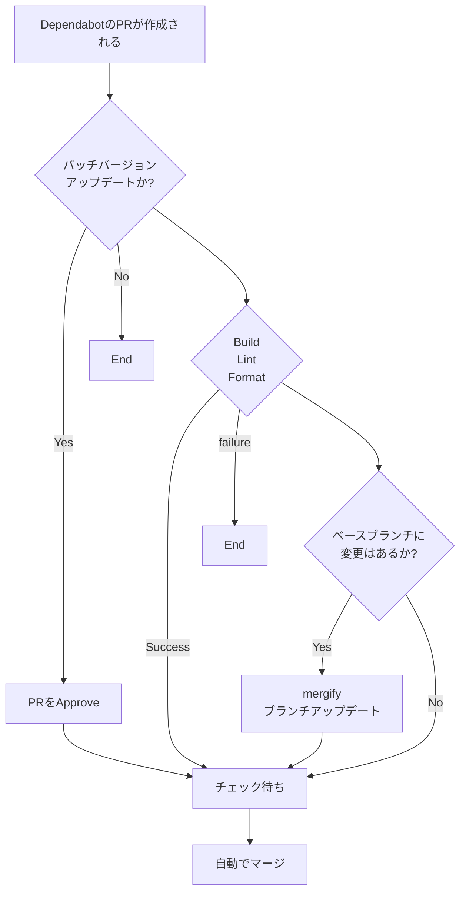

GitHub で依存管理に使っている Dependabot ですが、いちいち自分でマージするのは面倒に感じます。
そこで、GitHub Actions と [Mergify](https://docs.mergify.com/#) を使って条件付きで自動マージするようにします。

# 今回の条件

- GitHub Actions での判定
  - [x] パッチバージョンアップデートであること
- Mergify での判定
  - [x] PR の作成者が `dependabot[bot]`
  - [x] PR の Approve が 1 以上
  - [x] ビルドテスト、ESLint、Prettier のチェックに成功
  - [x] PR ブランチが最新の状態になっている

:::details Marmeid で書いたフローチャート

:::
