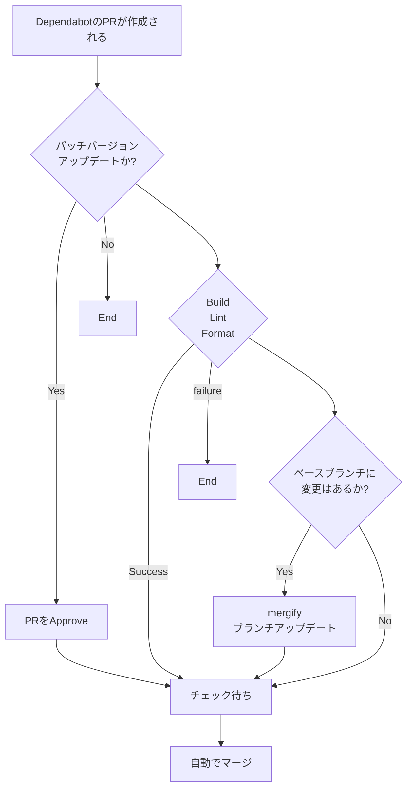

GitHub で依存管理に使っている Dependabot ですが、いちいち自分でマージするのは面倒に感じます。
そこで、[GitHub Actions](https://github.co.jp/features/actions) と [Mergify](https://docs.mergify.com/) を使って条件付きで自動マージするようにします。
今回の例では yarn を使った Node.js のプロジェクトを想定していますが、他の環境でも応用できると思います。

# 今回の条件

- [x] パッチバージョンのアップデートであること
- [x] ビルドテスト、ESLint、Prettier のチェックに成功していること
- [x] PR の Approve が 1 以上あること
- [x] PR の作成者が `dependabot[bot]` であること
- [x] PR ブランチが最新の状態になっていること

:::details Marmeid で書いたフローチャート



:::

# Dependabot の設定

`npm` と `github-actions` を週でアップデートの確認をしてもらっています。

```yml:.github/dependabot.yml
version: 2
updates:
  - package-ecosystem: 'npm'
    directory: '/'
    schedule:
      interval: 'weekly'

  - package-ecosystem: 'github-actions'
    directory: '/'
    schedule:
      interval: 'weekly'
```

# GitHub Actions の設定

## ビルドテスト

テストコードを実装していればそれを指定するのもいいかもしれません。
`concurrency` を使って同じ PR の Action が 2 重で走らないようにしています。

```yml:.github/build.yml
name: Build test

on:
  pull_request:

jobs:
  build-test:
    runs-on: ubuntu-latest
    steps:
      - name: Checkout
        uses: actions/checkout@v3

      - name: Setup Node
        uses: actions/setup-node@v3
        with:
          node-version: '16'
          cache: 'npm'

      - name: Install packages
        run: yarn install --immutable --immutable-cache --check-cache

      - name: Build
        run: yarn build

concurrency:
  group: ${{ github.workflow }}-${{ github.ref }}
  cancel-in-progress: true
```

## ESLint、Prettier のチェック

依存関係のアップデートに必要か？と考えますが、ESLint と Prettier のアップデートがあったときにチェックしたいので含めています。

```yml:.github/check.yml
name: Check lint and format

on:
  pull_request:

jobs:
  check-lint-and-format:
    runs-on: ubuntu-latest
    steps:
      - name: Checkout
        uses: actions/checkout@v3

      - name: Setup Node
        uses: actions/setup-node@v3
        with:
          node-version: 16
          cache: 'npm'

      - name: Install packages
        run: yarn install --immutable --immutable-cache --check-cache

      - name: ESLint
        run: yarn lint

      - name: Prettier
        run: yarn format

concurrency:
  group: ${{ github.workflow }}-${{ github.ref }}
  cancel-in-progress: true
```

## パッチアップデートの判別と自動 Approve

`if: ${{ steps.dependabot-metadata.outputs.update-type == 'version-update:semver-patch' }}` にてパッチアップデートの判別をしています。
ここでパッチアップデートの場合は `github-actions` ユーザーが Approve をします。

```yml:.github/dependabot-auto-approve.yml
name: Auto approve on dependabot PR at patch update

on:
  pull_request_target:
    types:
      - opened

permissions:
  pull-requests: write

jobs:
  dependabot-auto-approve:
    runs-on: ubuntu-latest
    if: ${{ github.actor == 'dependabot[bot]' }}
    steps:
      - name: Dependabot metadata
        id: dependabot-metadata
        uses: dependabot/fetch-metadata@v1.3.4
        with:
          github-token: '${{ secrets.GITHUB_TOKEN }}'
      - name: Approve a PR
        if: ${{ steps.dependabot-metadata.outputs.update-type == 'version-update:semver-patch' }}
        run: gh pr review --approve "$PR_URL"
        env:
          PR_URL: ${{ github.event.pull_request.html_url }}
          GITHUB_TOKEN: ${{ secrets.GITHUB_TOKEN }}
```

### `github-actions` ユーザーによる PR の Approve を可能にする

Organization の設定から以下を許可する必要があります。
<https://github.com/organizations/org-name/settings/actions> → Workflow permissions

```text
Workflow permissions
🔘 Read and write permissions

Choose whether GitHub Actions can create pull requests or submit approving pull request reviews.
✅ Allow GitHub Actions to create and approve pull requests
```


