GitHub で依存管理に使っている Dependabot ですが、いちいち自分でマージするのは面倒に感じます。
そこで、[GitHub Actions](https://github.co.jp/features/actions) と [Mergify](https://mergify.com/) を使って条件付きで自動マージするようにします。
今回の例では yarn を使った Node.js のプロジェクトを想定していますが、他の環境でも応用できると思います。

# 今回の条件

- [x] パッチバージョンのアップデートであること
- [x] PR の Approve が 1 以上あること
- [x] ビルドテスト、ESLint、Prettier のチェックに成功していること
- [x] PR の作成者が`dependabot[bot]`であること
- [x] PR ブランチが最新の状態になっていること

<!-- textlint-disable ja-technical-writing/ja-no-mixed-period -->

:::details Marmeid で書いたフローチャート



:::

<!-- textlint-enable ja-technical-writing/ja-no-mixed-period -->

# Dependabot の設定

`npm`と`github-actions`を週でアップデートの確認をしてもらっています。

```yml:.github/dependabot.yml
version: 2
updates:
  - package-ecosystem: 'npm'
    directory: '/'
    schedule:
      interval: 'weekly'

  - package-ecosystem: 'github-actions'
    directory: '/'
    schedule:
      interval: 'weekly'
```

# GitHub Actions の設定

## パッチアップデートの判別と自動 Approve

`if: ${{ steps.dependabot-metadata.outputs.update-type == 'version-update:semver-patch' }}`にてパッチアップデートの判別をしています。
ここでパッチアップデートの場合は`github-actions`ユーザーが Approve をします。

`failed to create review: Message: GitHub Actions is not permitted to approve pull requests.`で Action が失敗する場合は [`github-actions`ユーザーによる PR の Approve を可能にする](#github-actions-ユーザーによる-pr-の-approve-を可能にする) を設定する必要があります。

```yml:.github/dependabot-auto-approve.yml
name: Auto approve on dependabot PR at patch update

on:
  pull_request_target:
    types:
      - opened

permissions:
  pull-requests: write

jobs:
  dependabot-auto-approve:
    runs-on: ubuntu-latest
    if: ${{ github.actor == 'dependabot[bot]' }}
    steps:
      - name: Dependabot metadata
        id: dependabot-metadata
        uses: dependabot/fetch-metadata@v1.3.4
        with:
          github-token: '${{ secrets.GITHUB_TOKEN }}'
      - name: Approve a PR
        if: ${{ steps.dependabot-metadata.outputs.update-type == 'version-update:semver-patch' }}
        run: gh pr review --approve "$PR_URL"
        env:
          PR_URL: ${{ github.event.pull_request.html_url }}
          GITHUB_TOKEN: ${{ secrets.GITHUB_TOKEN }}
```

### `github-actions`ユーザーによる PR の Approve を可能にする

Organization の設定から以下を許可する必要があります。
<https://github.com/organizations/org-name/settings/actions> → Workflow permissions

```text
Workflow permissions
🔘 Read and write permissions

Choose whether GitHub Actions can create pull requests or submit approving pull request reviews.
✅ Allow GitHub Actions to create and approve pull requests
```


## ビルドテスト

単体テストを実装していればそれを指定するのもいいかもしれません。
`concurrency`を使って同じ PR の Action が 2 重で走らないようにしています。

```yml:.github/build.yml
name: Build test

on:
  pull_request:

jobs:
  build-test:
    runs-on: ubuntu-latest
    steps:
      - name: Checkout
        uses: actions/checkout@v3

      - name: Setup Node
        uses: actions/setup-node@v3
        with:
          node-version: '16'
          cache: 'npm'

      - name: Install packages
        run: yarn install --immutable --immutable-cache --check-cache

      - name: Build
        run: yarn build

concurrency:
  group: ${{ github.workflow }}-${{ github.ref }}
  cancel-in-progress: true
```

## ESLint、Prettier のチェック

依存関係のアップデートに必要か？と考えますが、ESLint と Prettier のアップデートがあったときにチェックしたいので含めています。

```yml:.github/check.yml
name: Check lint and format

on:
  pull_request:

jobs:
  check-lint-and-format:
    runs-on: ubuntu-latest
    steps:
      - name: Checkout
        uses: actions/checkout@v3

      - name: Setup Node
        uses: actions/setup-node@v3
        with:
          node-version: 16
          cache: 'npm'

      - name: Install packages
        run: yarn install --immutable --immutable-cache --check-cache

      - name: ESLint
        run: yarn lint

      - name: Prettier
        run: yarn format

concurrency:
  group: ${{ github.workflow }}-${{ github.ref }}
  cancel-in-progress: true
```

# Mergify の設定

<https://mergify.com/> から GitHub アカウントでログインし、設定したいリポジトリと連携します。
リポジトリの連携後、Config Editor から以下の設定を追加します。([公式ドキュメント](https://docs.mergify.com/))

```yml:.mergify.yml
pull_request_rules:
  - name: automatic merge for Dependabot pull requests
    conditions:
      - author = dependabot[bot] # PR の作成者が `dependabot[bot]` であること
      - '#approved-reviews-by >= 1' # PR の Approve が 1 以上あること
      - check-success = build-test # ビルドテストに成功していること
      - check-success = check-lint-and-format # ESLint、Prettier のチェックに成功していること
    actions:
      merge:
        method: merge
  - name: automatic update for PR # PR ブランチが最新の状態になっていること
    conditions:
      - author = dependabot[bot]
    actions:
      update:
```

設定では以下の点につまづきました。

- `check-success`に指定する名前
  - Action の job 名を指定する必要があります。
- `#`で始まるの属性の指定方法
  - シングルクォーテーションまたはダブルクォーテーションで括って文字列として認識させる必要があります。

# 動作確認

うまく設定ができると PR に Mergify Summary が追加され、`Rule: automatic merge for Dependabot pull requests (merge)`に全てチェックがつくと自動でマージされます。


# まとめ

今回は GitHub Actions と Mergify を使って条件付きで Dependabot の PR を自動マージするようにしました。
みなさんもご自身の環境に合わせて設定してみてはいかがでしょうか。
